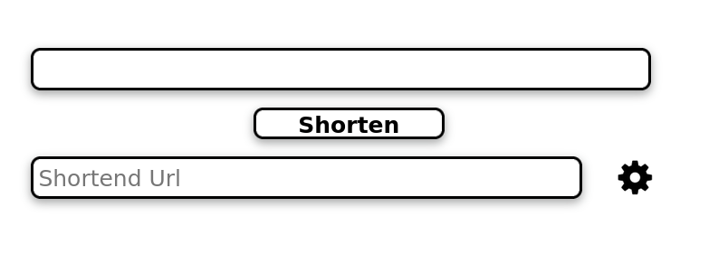
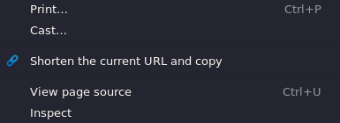

<h1>URL Shorten Extension</h1>

## Description

This extension allows you to shorten URLs using **is.gd, v.gd, tny.im, bit.ly, tinyurl.com**.

## Features
1. Uses is.gd, v.gd, tny.im, bit.ly, tinyurl.com
2. Use of Right Click Menu

    

3. Generate QR Code

4. Auto-Copy URL to Clipboard
5. Dark-Mode support

    
    

## Installation
### For Chrome

1. Download the source code as zip and unzip it.

2. Goto Chrome Settings using three dots on the top right corner. Click on **Extensions**.

3. Now, Enable developer mode.

4. Click on **Load unpacked extension** and selct the folder **Chrome** from the unzipped folder.

5. Pin the extension to the **Chrome** menu.

    

<!-- ### For Firefox -->
